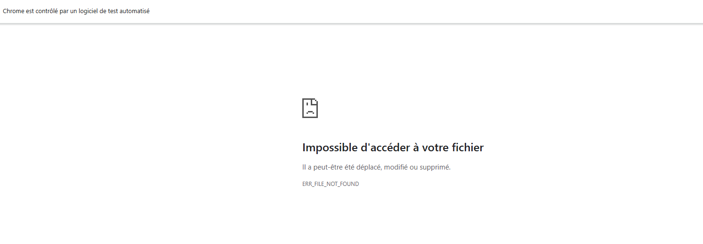

# selenium-cicd-tp

# 2.3
================================================== short test summary info ==================================================      
ERROR tests\test_selenium.py::TestCalculator::test_page_loads - AttributeError: 'NoneType' object has no attribute 'split'
ERROR tests\test_selenium.py::TestCalculator::test_addition - AttributeError: 'NoneType' object has no attribute 'split'
ERROR tests\test_selenium.py::TestCalculator::test_division_by_zero - AttributeError: 'NoneType' object has no attribute 'split'   
ERROR tests\test_selenium.py::TestCalculator::test_all_operations - AttributeError: 'NoneType' object has no attribute 'split'     
===================================================== 4 errors in 1.36s =====================================================  

4 erreurs dans le code. Les tests n'ont pas failed, c'est juste qu'ils n'ont même pas pu démarrer

